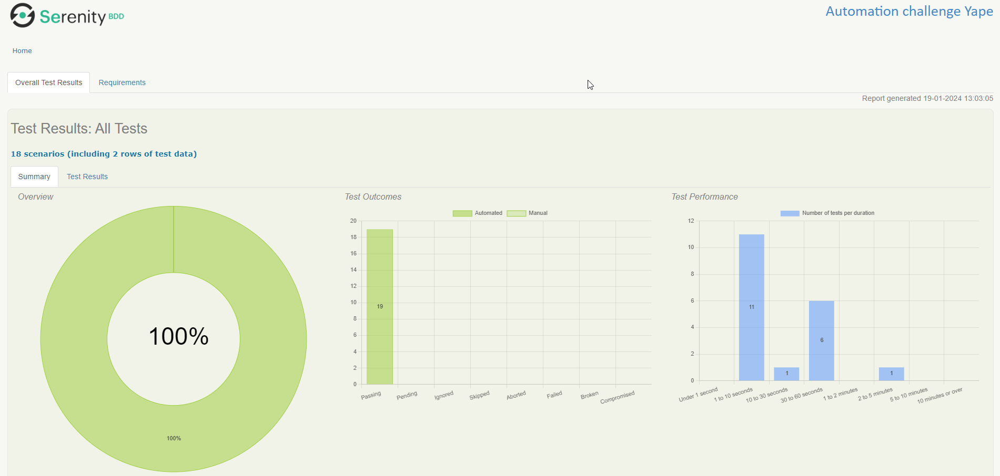
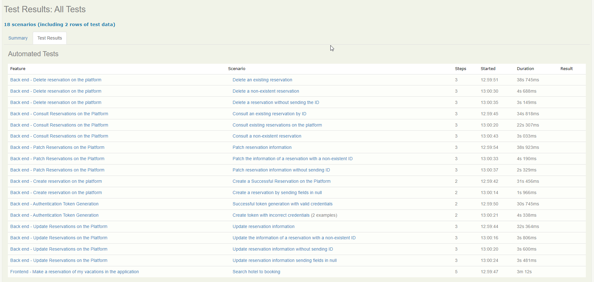

# CHALLENGE AUTOMATIZACIÓN YAPE

---

## Herramientas implementadas:
* Serenity BDD
* Serenity Rest
* Appium
* Selenium
* Cucumber
* JUnit
* Lombok

### Patron de diseño:
* Screenplay

### Lenguaje de programación:
* Java

### Gestor de dependencias:
* Gradle

---

## Pre-Condiciones:
* Tener instalado el [JDK](https://www.oracle.com/co/java/technologies/javase/javase8-archive-downloads.html) Java con versione igual o superior a 1.8
* Tener instalado y configurado [GRADLE](https://gradle.org/releases/).
* Tener instalado [Appium](https://github.com/appium/appium-desktop/releases).
* Clone el proyecto de la rama **main** con el siguiente comando:
    * `git clone https://github.com/dfmerchan2/challenge-yape.git`

---

## Compilar y ejecutar
* ### Ejecución Mobile
  * Tener ejecutando el Appium Server
  * En la clase **MyDriver** ubicada en ```src/main/java/co/com/yape/mobile/utilities/MyDriver.java``` configurar la data del dispositivo o emulador donde se va a ejecutar el test. 
    * **deviceName:** nombre del dispositivo
    * **platformVersion:** Version de android del dispositivo
* ### Comandos Gradle
```
gradle build -x test                                                        (Compilar el proyecto)
gradle test --tests *ConsultBookingRunner* =>                               (Ejecutar un Runner en especifico)
gradle test --tests *ConsultBookingRunner* --tests *CreateBookingRunner*    (Ejecutar varios Runners en especifico)
gradle test aggregate                                                       (Ejecutar toda la suite de pruebas en el proyecto y generar reporte se serenity)
gradle clean test --tests "co.com.yape.backend.runner.*" aggregate -i       (Ejecutar un paquete de Runners)
```


---
## Reporte Serenity
* Cuando finalice la ejecución del los test, ingrese a la ruta **"target/site/serenity"** y abra el archivo **index.html** en el navegador, para poder visualizar el reporte de Serenity.



---


## Autor 🤖

* Diego Fernando Merchan Jimenez
    